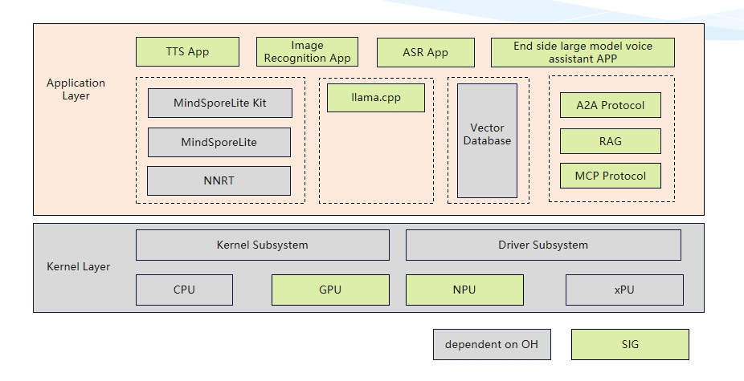

# sig_ai_model
English | [简体中文](./sig_ai_model_cn.md)

Note: The content of this SIG follows the convention described in OpenHarmony's PMC Management Charter [README](../../zh/pmc.md).

## SIG architecture

## SIG group work objectives and scope

### work goals
Enrich application models of various sizes and provide end-to-end examples.

### work scope
- Northbound applications, such as DeepSeek cloud app, voice assistant app, QA app, ASR/TTS/CV and other application demos.
- Systems and third-party libraries, such as the inference framework llama.cpp, RAG, MCP.
- Southbound chips, such as AMD GPU drivers and NPU drivers.

### rules and procedures for joining members

1. Applying to join SIG as an enterprise requires undertaking 1 co construction task and having 2 developers.
2. Applying to join SIG as an individual/school requires undertaking 1 co construction task and having sufficient time.
3. The co construction task can be listed in the co construction development task table or self submitted for review.
4. The application email should be sent to <houpengfei@openvalley.net> to review, explaning the member name, personnel, and the co construction task.
5. The team leader Openvally and the deputy team leader Huawei are the initial members.

## SIG Members

### Leader
- @talkweb_houpengfei(https://gitee.com/talkweb_houpengfei)

### Committers
-  @tanpengju(https://gitee.com/tanpengju)
-  @yuan-dan-1(https://gitee.com/yuan-dan-1)
-  @xfanonymous(https://gitee.com/xfanonymous)

### Meetings
- Meeting time: once a week for the first two months, and once every two weeks thereafter; Wednesday 10:00-12:00
- Meeting proposal：[OpenHarmony AI Model SIG Meeting Proposal](https://shimo.im/sheets/913JMRpR91T44oAE/MODOC)
- Meeting link: Notify via email

### Contact (optional)

- Mailing list：sig_ai_model@openharmony.io
- Wechat group：xxx
