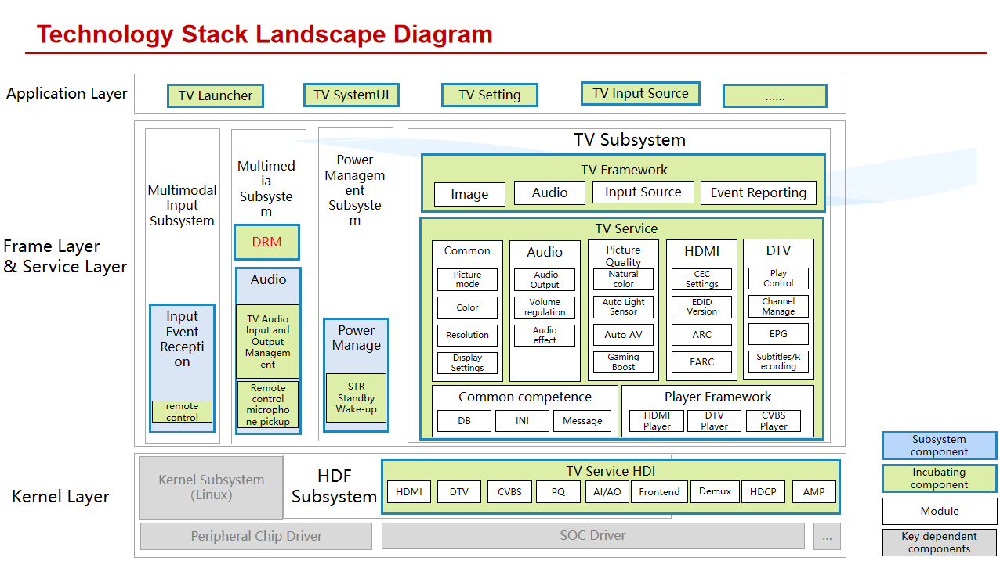

# sig_tv
English | [简体中文](./sig_tv_cn.md)

Note: The content of this SIG follows the convention described in OpenHarmony's PMC Management Charter [README](../../zh/pmc.md).

## SIG Technology Stack Landscape Diagram

The TV technology stack panoramic architecture diagram is divided from bottom to top into the kernel layer, framework & service layer, and application layer.
### Kernel Layer
 - Kernel subsystem (Linux): Built upon the Linux kernel, providing the underlying runtime environment and responsible for basic functions such as hardware resource management and process scheduling.
 - Peripheral device drivers: Interface with various peripheral hardware (such as remote controls, audio output devices, etc.), enabling data interaction between hardware and upper-level software.
 - SOC chip drivers: Developed specifically for TV main control SOC chips, coordinating the work of internal hardware modules (such as CPU, GPU, decoding modules, etc.) to ensure the normal operation of core chip functions.
 - HDF subsystem: Hardware driver framework that standardizes hardware driver development processes, providing unified hardware access interfaces to upper layers and reducing hardware adaptation complexity.
### Framework & Service Layer
#### Multi-modal Input Subsystem
 - Input Event Reception: Responsible for capturing user operations (such as remote control buttons, external device commands).
 - Remote Control: Parses remote control button commands to implement basic interactions like channel switching and volume adjustment.
#### Media Subsystem
 - DRM (Digital Rights Management): Protects audio and video content copyrights, encrypts and decrypts protected content to prevent illegal copying and distribution.
 - Audio Management: Covers TV audio input/output management (e.g., external amplifier, SPDIF), and remote control microphone pickup.
 - Power Management Subsystem：Power Management: Controls TV power states, including standby and wake-up (STR standby wake-up).
#### TV Subsystem
 - TV Framework (Framework Layer): Defines basic functions such as image, sound, input source, and event reporting.
 - TV Service (Service Layer): Divided into functional modules including audio/video and picture quality, implementing specific services:
     - Common: Image mode switching, color/clarity/screen settings
     - Sound: Audio output, volume adjustment, sound enhancement
     - Picture Quality: Natural color, auto light sensing, auto tone adjustment, game enhancement
     - HDMI/DTV: HDMI handles CEC settings, EDID version, ARC/eARC interface functions; DTV implements playback control, channel management, electronic program guide, recording/scheduling and other digital TV services
     - Common Capabilities: Database (stores system configuration/user preferences), configuration parsing (loads system/user parameters), message monitoring (captures system/business events), providing basic capabilities for all modules
     - Player Framework: Interfaces with HDMI, DTV, CVBS protocols and interfaces, implementing audio/video content decoding and playback control
 - TV Service HDI: Hardware abstraction layer interface, shielding underlying hardware differences upward and interfacing with specific hardware drivers (such as HDMI, DTV hardware modules) downward
### Application Layer:
 - TV Launcher: The primary interactive interface displayed when users boot up the device.
 - TV SystemUI: System interface components that assist users in quickly adjusting system status (such as volume, brightness).
 - TV Settings: The system configuration center where users can adjust parameters including image, sound, network, and device connections.
 - TV Input Source: Manages signal input from external devices (such as set-top boxes, game consoles, USB drives), allowing users to switch between different input sources.

## SIG group work objectives and scope

### work goals
Based on the OH community, working hand in hand with industry ecosystem partners, we will enhance large-screen key technology capabilities, promote industry standardization, strengthen ecological cooperation, and facilitate the prosperity of the OH ecosystem.

### work scope
1. Capability Enhancement: Strengthen key capabilities for large-screen devices
 - System Applications: Develop large-screen versions of system applications (Launcher, Setting, SystemUI, Input Sources, etc.)
 - System Capabilities: Build dedicated subsystem capabilities for large screens (TV subsystem, projection subsystem, miracast/DLNA screen casting Sink,large-screen specific audio/video codecs, focus control, etc.)
 - Chips and Peripherals: Complete adaptation of large-screen SOC chips and peripheral chips (AMP/MIC/PANEL), as well as peripheral accessories (remote control/microphone/gamepad, etc.)

2. Establish Standards: Standardization to promote industry development
Advance large-screen standard system for TVs/conference screens
 - XTS Compatibility: Enhance compatibility with large-screen unique capabilities
 - Information Technology Application Innovation Standards: Incorporate education large-screen standards
 - Centralized Procurement Specifications: Comply with carrier centralized procurement norms

3. Building Ecosystem: Working hand in hand with ecological partners to jointly promote ecosystem prosperity.
 - Northbound Application Ecosystem: Attract third-party application vendors to participate in ecosystem co-construction,OH northbound ecosystem. Meanwhile, incorporate application vendors' requirements into the system for co-construction, enhancing application innovation capabilities and competitiveness.
 - Southbound Chip Ecosystem: Attract large-screen chip manufacturers to participate in ecosystem co-construction, providing chips of various specifications to support commercial shipment of diverse large-screen devices. By combining chip and system capabilities, support partners in developing competitive products.
 - End-to-End Device Ecosystem: Attract top traditional vendors in the industry chain to join the OH large-screen ecosystem, develop competitive products for commercial shipment, and support widespread commercial adoption of OH products.

### Main Work Direction and Content 
1、Attract large-screen chip manufacturers to contribute SDKs and development boards, building a unified verification platform for large screens.
2、Collaboratively develop large-screen system capabilities based on common hardware platforms.
3、Support large-screen northbound applications, southbound chips, and peripheral accessories integration into the OH technology ecosystem.
4、Accelerate chip, system, and third-party application maturity through ecosystem partner commercial projects, supporting the prosperity of the large-screen ecosystem.
5、Serve as a focal point to collect and implement the latest industry technologies and demands into the TV SIG, enhancing the competitiveness of the OH large-screen system.

### Planned Contributions

## SIG Members

### Leader
- @shuguang-wang(https://gitee.com/shuguang-wang)

### Committers
- @leven1(https://gitee.com/leven1)
- @lite-eos(https://gitee.com/lite-eos)
- @qibaowei.zhu(https://gitee.com/qibaowei.zhu)
- @xyanggogo(https://gitee.com/xyanggogo)
- @SeanHW(https://gitee.com/SeanHW)
- @18673380227(https://gitee.com/18673380227)
- @yao-lei770708(https://gitee.com/yao-lei770708)
- @ztfrdas(https://gitee.com/ztfrdas)
- @chen-xuejun01(https://gitee.com/chen-xuejun01)
- @caizhigang20231018(https://gitee.com/caizhigang20231018)
- @pai_666(https://gitee.com/pai_666)
- @chengcharchar(https://gitee.com/chengcharchar)
- @zhangguorong(https://gitee.com/zhangguorong)
- @15002264759(https://gitee.com/15002264759)
- @donglin_lu(https://gitee.com/donglin_lu)
- @yan-kaiyun(https://gitee.com/yan-kaiyun)
- @18573110257(https://gitee.com/18573110257)

### Meetings
 - Meeting time：Bi-weekly meeting, every Friday from 4:00 PM to 5:30 PM
 - Meeting application：[OpenHarmony TV SIG Meeting Proposal](https://docs.qingque.cn/s/home/eZQD5fEgz0p9aMBiO68_Ymyt0?identityId=2JZgg0BEwbM)
 - Meeting link：Notify via email
 - Meeting-Minutes：[Archive link address](https://gitee.com/openharmony/community/blob/master/sig/sig_tv/meetings)

### Contact (optional)

- Mailing list：dev@openharmony.io
- Wechat group：NA
